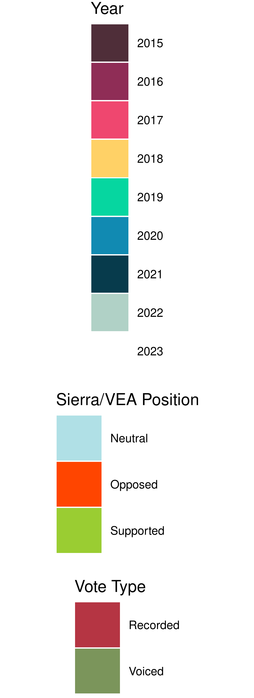

```{r global, echo=FALSE}
library(bslib)
library(flexdashboard)
library(plotly)
library(ggplot2)
library(plyr)
library(reactable)

source("functions.R")

csv15 <- read.csv("data/csv_2015.csv") %>% col_care() %>% add_identifiers() %>% mutate(Year = 2015) %>%
    separate(Com.1, into = c("Com.1", "Com.1.2", "Com.1.3", "Com.1.4"), sep = ";")
csv16 <- read.csv("data/csv_2016.csv", nrows = 74) %>% col_care() %>% add_identifiers() %>% mutate(Year = 2016) %>%
    separate(Com.1, into = c("Com.1", "Com.1.2", "Com.1.3", "Com.1.4"), sep = ";")
csv17 <- read.csv("data/csv_2017.csv", nrows = 89) %>% col_care() %>% add_identifiers() %>% mutate(Year = 2017) %>%
    separate(Com.1, into = c("Com.1", "Com.1.2", "Com.1.3", "Com.1.4"), sep = ";")
csv18 <- read.csv("data/csv_2018.csv", nrows = 111) %>% col_care() %>% add_identifiers() %>% mutate(Year = 2018) %>%
    separate(Com.1, into = c("Com.1", "Com.1.2", "Com.1.3", "Com.1.4"), sep = ";")
csv19 <- read.csv("data/csv_2019.csv", nrows = 92) %>% col_care() %>% add_identifiers() %>% mutate(Year = 2019) %>%
    separate(Com.1, into = c("Com.1", "Com.1.2", "Com.1.3", "Com.1.4"), sep = ";")
csv20 <- read.csv("data/csv_2020.csv", nrows = 92) %>% col_care() %>% add_identifiers() %>% mutate(Year = 2020) %>%
    separate(Com.1, into = c("Com.1", "Com.1.2", "Com.1.3", "Com.1.4"), sep = ";")
csv21 <- read.csv("data/csv_2021.csv", nrows = 84) %>% col_care() %>% add_identifiers() %>% mutate(Year = 2021) %>%
    separate(Com.1, into = c("Com.1", "Com.1.2", "Com.1.3", "Com.1.4"), sep = ";")

csv_total <- rbind(csv15, csv16, csv17, csv18, csv19, csv20, csv21)

colors <- list("y2015" = "4f2e39", "y2016" = "8f2d56", "y2017" = "ef476f", "y2018" = "ffd166", "y2019" = "06d6a0", "y2020" = "118ab2", "y2021" = "073b4c",
               "dead" = "6a5d5d")
labs <- c("Introduced", "Committee 1", "Floor 1",
          "Committee 2", "Floor 2",
          "Delivered to Governor", "Signed by Governor", "Law", "Dead")
# Old link hover doesn't include expanded acronym
#link_hover <- paste("Flow between %{source.label}<br>",
#                   "and %{target.label}",
#                   "<extra>%{value:.0f}</extra>")
link_hover <- paste("Flow between %{customdata[0]}<br>",
                   "and %{customdata[1]}",
                   "<extra>%{value:.0f}</extra>")
node_hover <- paste("%{customdata}",
                   "<extra>%{value:.0f}</extra>")
# Stuff for General Overview
joint_year <- rbind(
                    data_creator(csv15, colors$y2015),
                    data_creator(csv16, colors$y2016),
                    data_creator(csv17, colors$y2017),
                    data_creator(csv18, colors$y2018),
                    data_creator(csv19, colors$y2019),
                    data_creator(csv20, colors$y2020),
                    data_creator(csv21, colors$y2021)
                )
# Adds committees
csv_com_total <- separate(csv_total, Com.1, into = "Com.1", sep = ";") %>%
    mutate(Com.1 = if_else(Com.1 == "H-CL" | Com.1 == "H-LC", "H-CL/LC", Com.1),
    Com.2 = if_else(Com.2 == "H-CL" | Com.2 == "H-LC", "H-CL/LC", Com.2))
committees_total <- com_sierra(csv_com_total)
labels_total <- c("Introduced", levels(committees_total$x)[2:4], "Other Committee", "Passed Floor 1", gsub(".{2}$", "", levels(committees_total$x)[7:9]), "Other Committee", "Passed Floor 2", "Delivered to Governor", "Signed by Governor", "Passed")

com_15 <- com_creator(csv15, colors$y2015)
com_16 <- com_creator(csv16, colors$y2016)
com_17 <- com_sierra(csv17)
com_18 <- com_sierra(csv18)
com_19 <- com_sierra(csv19)
com_20 <- com_sierra(csv20)
com_21 <- com_sierra(csv21)
labels_15 <- c("Introduced", levels(com_15$x)[2:4], "Other Committee", "Passed Floor 1", gsub(".{2}$", "", levels(com_15$x)[7:9]), "Other Committee", "Passed Floor 2", "Delivered to Governor", "Signed by Governor", "Law")
labels_16 <- c("Introduced", levels(com_16$x)[2:4], "Other Committee", "Passed Floor 1", gsub(".{2}$", "", levels(com_16$x)[7:9]), "Other Committee", "Passed Floor 2", "Delivered to Governor", "Signed by Governor", "Law")
labels_17 <- c("Introduced", levels(com_17$x)[2:4], "Other Committee", "Passed Floor 1", gsub(".{2}$", "", levels(com_17$x)[7:9]), "Other Committee", "Passed Floor 2", "Delivered to Governor", "Signed by Governor", "Law")
labels_18 <- c("Introduced", levels(com_18$x)[2:4], "Other Committee", "Passed Floor 1", gsub(".{2}$", "", levels(com_18$x)[7:9]), "Other Committee", "Passed Floor 2", "Delivered to Governor", "Signed by Governor", "Law")
labels_19 <- c("Introduced", levels(com_19$x)[2:4], "Other Committee",  "Passed Floor 1", gsub(".{2}$", "", levels(com_19$x)[7:9]), "Other Committee", "Passed Floor 2", "Delivered to Governor", "Signed by Governor", "Law")
labels_20 <- c("Introduced", levels(com_20$x)[2:4], "Other Committee",  "Passed Floor 1", gsub(".{2}$", "", levels(com_20$x)[7:9]), "Other Committee", "Passed Floor 2", "Delivered to Governor", "Signed by Governor", "Law")
labels_21 <- c("Introduced", levels(com_21$x)[2:4], "Other Committee",  "Passed Floor 1", gsub(".{2}$", "", levels(com_21$x)[7:9]), "Other Committee", "Passed Floor 2", "Delivered to Governor", "Signed by Governor", "Law")


null15 <- read.csv("data/null_2015.csv") %>% mutate(Year = 2015) %>% separate(Com.1, into = c("Com.1", "Com.1.2", "Com.1.3", "Com.1.4"), sep = ";")
null16 <- read.csv("data/null_2016.csv") %>% mutate(Year = 2016) %>% separate(Com.1, into = c("Com.1", "Com.1.2", "Com.1.3", "Com.1.4"), sep = ";")
null17 <- read.csv("data/null_2017.csv") %>% mutate(Year = 2017) %>% separate(Com.1, into = c("Com.1", "Com.1.2", "Com.1.3", "Com.1.4"), sep = ";")
null18 <- read.csv("data/null_2018.csv") %>% mutate(Year = 2018) %>% separate(Com.1, into = c("Com.1", "Com.1.2", "Com.1.3", "Com.1.4"), sep = ";")
null19 <- read.csv("data/null_2019.csv") %>% mutate(Year = 2019) %>% separate(Com.1, into = c("Com.1", "Com.1.2", "Com.1.3", "Com.1.4"), sep = ";")
null20 <- read.csv("data/null_2020.csv") %>% mutate(Year = 2020) %>% separate(Com.1, into = c("Com.1", "Com.1.2", "Com.1.3", "Com.1.4"), sep = ";")
null21 <- read.csv("data/null_2021.csv") %>% mutate(Year = 2021) %>% separate(Com.1, into = c("Com.1", "Com.1.2", "Com.1.3", "Com.1.4"), sep = ";")
vv_15 <- data_creator_vv(null15, TRUE, FALSE)
vv_16 <- data_creator_vv(null16, TRUE, FALSE)
vv_17 <- data_creator_vv(null17, TRUE, FALSE)
vv_18 <- data_creator_vv(null18, TRUE, FALSE)
vv_19 <- data_creator_vv(null19, TRUE, FALSE)
vv_20 <- data_creator_vv(null20, TRUE, FALSE)
vv_21 <- data_creator_vv(null21, TRUE, FALSE)

null_total <- rbind(null15, null16, null17, null18, null19, null20, null21)
vv_total <- data_creator_vv(null_total, TRUE, FALSE)

```

# Sidebar {.sidebar data-width=200}

### Legend

```{r}
#library(cowplot)
#library(grid)
#library(gridExtra)
#library(ggpubr)
#
## A bunch of spaces added after 2015 to line everything up
#base_graph <- ggplot(csv_total, aes(Year, fill = as.character(Year))) + geom_bar() + 
#  scale_fill_manual(
#                     values = c("2015\ \ \ \ \ \ \ " = paste("#",colors$y2015, sep = ""),"2016" = paste("#",colors$y2016, sep = ""),  "2017" = paste("#",colors$y2017, sep = ""),"2018" = paste("#",colors$y2018, sep = ""),"2019" = paste("#",colors$y2019, sep = ""),
#                                "2020" = paste("#",colors$y2020, sep = ""),"2021" = paste("#",colors$y2021, sep = ""))) +
#  theme_minimal() +
#  labs(title = "Fate of Different Bills in Relation to Sierra Club's Position in 2017 and 2018",
#       x = "Final Outcome of Bill", y = "Number of Bills",
#       fill = "Year") + 
#    theme(legend.text = element_text(size = 13),
#          legend.title = element_text(size = 18),
#          legend.key.size = unit(1.5, "cm"))
#legend_year <- get_legend(base_graph)
#
#gg17 <- ggplot(csv_total, aes(Dis, fill = Pos)) + geom_bar() +
#  scale_fill_manual(
#                     values = c("Supported" = "#9ACD32", "Neutral" = "#B0E0E6", "Opposed" = "#FF4500", "NA" = "#BEC4C6")) +
#  theme_minimal() +
#  scale_x_discrete(limits = c("Died in Committee", "Died Elsewhere", "Passed into Law")) + 
#  labs(title = "Fate of Different Bills in Relation to Sierra Club's Position in 2017 and 2018",
#       x = "Final Outcome of Bill", y = "Number of Bills",
#       fill = "Sierra Position") + 
#    theme(legend.text = element_text(size = 13),
#          legend.title = element_text(size = 18),
#          legend.key.size = unit(1.8, "cm"))
#legend_sierra <- get_legend(gg17)
#
#vv17 <- ggplot(mutate(null_total, VV = if_else(VV == 1, "Voiced", "Recorded")), aes(VV, fill = VV)) + geom_bar() +
#  scale_fill_manual(values = c( "Voiced" = "#7b955b", "Recorded" = "#B53543")) +
#  theme_minimal() +
#  labs(title = "Fate of Different Bills in Relation to Sierra Club's Position in 2017 and 2018",
#       x = "Final Outcome of Bill", y = "Number of Bills",
#       fill = "Vote Type") + 
#    theme(legend.text = element_text(size = 13),
#          legend.title = element_text(size = 18),
#          legend.key.size = unit(1.8, "cm"))
#legend_vv <- get_legend(vv17)
#
#plot_grid(legend_year, legend_sierra, legend_vv, nrow = 3, ncol = 1, rel_heights = c(0.5,0.3,0.2))
#ggsave("legend.png", bg = "transparent")
```
{#id .class width=80% height=80%}

# General Overview {data-orientation=columns}

Column {.tabset data-width=1000}
-------------------------------------

### Bill Lifetime per Year

```{r}
JOINT_YEAR <- plot_ly(
  domain = list(x = c(0, 1), y = c(0.51, 1)),
  type = "sankey",
  arrangement = "snap",
  node = list(
    label = labs,
    customdata = node_names(labs),
    x = c(0, 0.13, 0.2, 0.33, 0.5, 0.63, 0.81, 1, 1),
    y = c(0.5, 0.49, 0.20, 0.20, 0.20, 0.24, 0.17, 0.17, 0),
    color = "gray",
    hovertemplate = node_hover,
    thickness = 10,
    pad = 10),
  link = list(
    source = as.numeric(joint_year$x) - 1,
    target = as.numeric(joint_year$next_x) - 1,
    customdata = flow_names(joint_year),
    value = joint_year$n,
    color = ~as.factor(joint_year$color),
    hovertemplate = link_hover,
    line = list(color = "black", width = 0.5)
    )) %>%
  layout(title = "General Sankey Diagrams for 2015-2021",
         xaxis = list(showgrid = F, zeroline = F),
         yaxis = list(showgrid = F, zeroline = F),
         showlegend = T)
sierra_joint <- sierra_data(csv_total)

SIERRA_YEAR <- plot_ly(
  domain = list(x = c(0, 1), y = c(0, 0.49)),
  type = "sankey",
  arrangement = "snap",
  node = list(
    label = labs,
    customdata = node_names(labs),
    x = c(0, 0.13, 0.2, 0.33, 0.5, 0.63, 0.81, 1, 1),
    y = c(0.5, 0.49, 0.20, 0.20, 0.20, 0.24, 0.17, 0.17, 0),
    color = "gray",
    hovertemplate = node_hover,
    pad = 10,
    thickness = 10), # 10 Pixel
  link = list(
    source = as.numeric(sierra_joint$x) - 1,
    target = as.numeric(sierra_joint$next_x) - 1,
    customdata = flow_names(sierra_joint),
    value = sierra_joint$n,
    color = ~as.factor(sierra_joint$color),
    hovertemplate = link_hover,
    line = list(color = "black", width = 0.5)
    )) %>%
  layout(title = "General Sankey Diagrams for 2015-2021",
         xaxis = list(showgrid = F, zeroline = F),
         yaxis = list(showgrid = F, zeroline = F),
         showlegend = T)
subplot(JOINT_YEAR, SIERRA_YEAR, nrows = 2)
```

### Joint Overview

```{r}
yearly_sierra_joint <- plot_ly(
  domain = list(x = c(0, 1), y = c(0, 0.49)),
  type = "sankey",
  arrangement = "snap",
  node = list(
    label = labels_total,
    customdata = node_names(labels_total),
    x = c(0, 0.15, 0.15, 0.15, 0.15, 0.25, 0.4, 0.4, 0.4, 0.4, 0.5, 0.65, 0.8, 1),
    y = c(0, -0.2, 0.18, 0.22, 0.75, 0.5, 0.32, 0.38, 0.42, 0.72, 0.5, 0.6, 0.5, 0.5),
    color = "gray",
    hovertemplate = node_hover,
    thickness = 10,
    pad = 10), # 10 Pixel
  link = list(
    source = as.numeric(committees_total$x) - 1,
    target = as.numeric(committees_total$next_x),
    customdata = flow_names(committees_total),
    value = committees_total$n,
    color = ~as.factor(committees_total$color),
    hovertemplate = link_hover,
    line = list(color = "black", width = 0.5)
    ))%>%
  layout(title = "General Sankeys Separated by Committee",
         xaxis = list(showgrid = F, zeroline = F),
         yaxis = list(showgrid = F, zeroline = F),
         showlegend = T)

com_year_parts <- consolidate_com(csv_com_total)
levs <- c("Intro.Com", "H-CL/LC", "H-ACNR", "S-CL", "Other.Committee", "Pass.Floor.1", "S-CL.2", "S-ACNR.2", "H-CL/LC.2", "Other.Committee.2", "Pass.Floor.2", "To.Gov", "Passed", "Law")
com_year_total <- rbind(
                    com_creator(filter(com_year_parts, Year == 2015), colors$y2015, consol = FALSE),
                    com_creator(filter(com_year_parts, Year == 2016), colors$y2016, consol = FALSE),
                    com_creator(filter(com_year_parts, Year == 2017), colors$y2017, consol = FALSE),
                    com_creator(filter(com_year_parts, Year == 2018), colors$y2018, consol = FALSE),
                    com_creator(filter(com_year_parts, Year == 2019), colors$y2019, consol = FALSE),
                    com_creator(filter(com_year_parts, Year == 2020), colors$y2020, consol = FALSE),
                    com_creator(filter(com_year_parts, Year == 2021), colors$y2021, consol = FALSE)
)  %>%
    mutate(x = factor(as.character(x), levels = levs), next_x = factor(as.character(next_x), levels = levs))
yearly_joint <- plot_ly(
  domain = list(x = c(0, 1), y = c(0.51, 1)),
  type = "sankey",
  arrangement = "snap",
  node = list(
    label = labels_total,
    customdata = node_names(labels_total),
    x = c(0, 0.15, 0.15, 0.15, 0.15, 0.25, 0.4, 0.4, 0.4, 0.4, 0.5, 0.65, 0.8, 1),
    y = c(0, -0.2, 0.18, 0.22, 0.75, 0.5, 0.32, 0.38, 0.42, 0.72, 0.5, 0.6, 0.5, 0.5),
    color = "gray",
    hovertemplate = node_hover,
    thickness = 10,
    pad = 10), # 10 Pixel
  link = list(
    source = as.numeric(com_year_total$x) - 1,
    target = as.numeric(com_year_total$next_x) - 1,
    customdata = flow_names(com_year_total),
    value = com_year_total$n,
    color = ~as.factor(com_year_total$color),
    hovertemplate = link_hover,
    line = list(color = "black", width = 0.5)
    ))%>%
  layout(title = "General Sankeys Separated by Committee",
         xaxis = list(showgrid = F, zeroline = F),
         yaxis = list(showgrid = F, zeroline = F),
         showlegend = T)
subplot(yearly_sierra_joint, yearly_joint, nrows = 2)
```

### Dead Overview

```{r}
deadtotal <- sierra_data_dead(csv_total)
labs <- c("Introduced", "Passed Committee 1", "Passed Floor 1",
          "Passed Committee 2", "Passed Floor 2",
          "Delivered to Governor", "Signed by Governor", "Law", "Dead")
sierra_dead <- plot_ly(
  domain = list(x = c(0, 1), y = c(0, 0.49)),
  type = "sankey",
  arrangement = "snap",
  node = list(
    label = labs,
    customdata = node_names(labs),
    x = c(0, 0.23, 0.29, 0.40, 0.55, 0.67, 0.82, 1, 1),
    y = c(0.2, 0.5, 0.23, 0.18, 0.14, 0.21, -0.1, -0.1, 0.7),
    color = "gray",
    hovertemplate = node_hover,
    pad = 10), # 10 Pixel
  link = list(
    source = as.numeric(deadtotal$x) - 1,
    target = as.numeric(deadtotal$next_x) - 1,
    customdata = flow_names(deadtotal),
    value = deadtotal$n,
    color = ~as.factor(deadtotal$color),
    hovertemplate = link_hover,
    line = list(color = "black", width = 0.5)
    ))%>% 
  layout(title = "Sankey Diagrams with Dead Bills 2015-2021",
         xaxis = list(showgrid = F, zeroline = F),
         yaxis = list(showgrid = F, zeroline = F),
         showlegend = T)

dead_year_total <- rbind(
                    data_creator_dead(filter(csv_total, Year == 2015), colors$y2015),
                    data_creator_dead(filter(csv_total, Year == 2016), colors$y2016),
                    data_creator_dead(filter(csv_total, Year == 2017), colors$y2017),
                    data_creator_dead(filter(csv_total, Year == 2018), colors$y2018),
                    data_creator_dead(filter(csv_total, Year == 2019), colors$y2019),
                    data_creator_dead(filter(csv_total, Year == 2020), colors$y2020),
                    data_creator_dead(filter(csv_total, Year == 2021), colors$y2021)
) %>% color_dead()
yearly_dead <- plot_ly(
  domain = list(x = c(0, 1), y = c(0.51, 1)),
  type = "sankey",
  arrangement = "snap",
  node = list(
    label = labs,
    customdata = node_names(labs),
    x = c(0, 0.23, 0.29, 0.40, 0.55, 0.67, 0.82, 1, 1),
    y = c(0.2, 0.5, 0.23, 0.18, 0.14, 0.21, -0.1, -0.1, 0.7),
    color = "gray",
    hovertemplate = node_hover,
    pad = 10), # 10 Pixel
  link = list(
    source = as.numeric(dead_year_total$x) - 1,
    target = as.numeric(dead_year_total$next_x) - 1,
    customdata = flow_names(dead_year_total),
    value = dead_year_total$n,
    color = ~as.factor(dead_year_total$color),
    hovertemplate = link_hover,
    line = list(color = "black", width = 0.5)
    ))%>% 
  layout(title = "Sankey Diagrams with Dead Bills 2015-2021",
         xaxis = list(showgrid = F, zeroline = F),
         yaxis = list(showgrid = F, zeroline = F),
         showlegend = T)
subplot(sierra_dead, yearly_dead, nrows = 2)
```

### Return Sankey

```{r}
shelltotal <- sierra_data_shell(csv_total)
labs <- c("Introduced", "Passed Committee 1", "Passed Floor 1",
          "Passed Committee 2", "Passed Floor 2",
          "Delivered to Governor", "Signed", "Law", "Dead")
return_sierra <- plot_ly(
  domain = list(x = c(0, 1), y = c(0, 0.49)),
  type = "sankey",
  arrangement = "snap",
  node = list(
    label = labs,
    customdata = node_names(labs),
    x = c(0, 0.23, 0.35, 0.5, 0.6, 0.7, 0.9),
    y = c(0.5, 0.5, 0.5, 0.29, 0.4, 0.5, 0.3),
    color = "gray",
    hovertemplate = node_hover,
    pad = 10), # 10 Pixel
  link = list(
    source = as.numeric(shelltotal$x) - 1,
    target = as.numeric(shelltotal$next_x) - 1,
    customdata = flow_names(shelltotal),
    value = shelltotal$n,
    color = ~as.factor(shelltotal$color),
    hovertemplate = link_hover,
    line = list(color = "black", width = 0.5)
    ))%>% 
  layout(title = "Sankey Diagrams with Returned Bills 2015-2021",
         xaxis = list(showgrid = F, zeroline = F),
         yaxis = list(showgrid = F, zeroline = F),
         showlegend = T)

shelltotal_year <- rbind(
    data_creator_shell(filter(csv_total, Year == 2015), colors$y2015),
    data_creator_shell(filter(csv_total, Year == 2016), colors$y2016),
    data_creator_shell(filter(csv_total, Year == 2017), colors$y2017),
    data_creator_shell(filter(csv_total, Year == 2018), colors$y2018),
    data_creator_shell(filter(csv_total, Year == 2019), colors$y2019),
    data_creator_shell(filter(csv_total, Year == 2020), colors$y2020),
    data_creator_shell(filter(csv_total, Year == 2021), colors$y2021)
  )
return_year <- plot_ly(
  domain = list(x = c(0, 1), y = c(0.51, 1)),
  type = "sankey",
  arrangement = "snap",
  node = list(
    label = labs,
    customdata = node_names(labs),
    x = c(0, 0.23, 0.35, 0.5, 0.6, 0.72, 0.9),
    y = c(0.5, 0.5, 0.5, 0.29, 0.4, 0.5, 0.3),
    color = "gray",
    hovertemplate = node_hover,
    pad = 10), # 10 Pixel
  link = list(
    source = as.numeric(shelltotal_year$x) - 1,
    target = as.numeric(shelltotal_year$next_x) - 1,
    customdata = flow_names(shelltotal_year),
    value = shelltotal_year$n,
    color = ~as.factor(shelltotal_year$color),
    hovertemplate = link_hover,
    line = list(color = "black", width = 0.5)
    ))%>% 
  layout(title = "Sankey Diagrams with Returned Bills 2015-2021",
         xaxis = list(showgrid = F, zeroline = F),
         yaxis = list(showgrid = F, zeroline = F),
         showlegend = T)
subplot(return_sierra, return_year, nrows = 2)
```

### Control Sankey

```{r}
null_total_consol <- consolidate_com(null_total)
levs <- c("Introduced", levels(vv_total$x)[2:4], "Other Committee",  "Passed Floor 1", "Passed Committee 2", "Passed Floor 2", "Delivered to Governor", "Signed by Governor", "Law")

null_vv_total <- rbind(
                    data_creator(filter(null_total_consol, VV == 1),  "rgba(123,149,91,1.0)"),
                    data_creator(filter(null_total_consol, VV == 0),  "rgba(181,53,67,1.0)")
)
null_total_graph <- plot_ly(
  domain = list(x = c(0, 1), y = c(0, 0.49)),
  type = "sankey",
  arrangement = "snap",
  node = list(
    label = labs,
    customdata = node_names(labs),
    x = c(0, 0.13, 0.2, 0.33, 0.5, 0.63, 0.81, 1, 1),
    y = c(0.5, 0.49, 0.20, 0.20, 0.20, 0.20, 0.17, 0.17, 0),
    color = "gray",
    hovertemplate = node_hover,
    thickness = 10,
    pad = 10),
  link = list(
    source = as.numeric(null_vv_total$x) - 1,
    target = as.numeric(null_vv_total$next_x) - 1,
    customdata = flow_names(null_vv_total),
    value = null_vv_total$n,
    color = ~as.factor(null_vv_total$color),
    hovertemplate = link_hover,
    line = list(color = "black", width = 0.5)
    )) %>%
  layout(title = "Sankey Diagrams Sampling All Non-Climate Bills 2015-2021",
         xaxis = list(showgrid = F, zeroline = F),
         yaxis = list(showgrid = F, zeroline = F),
         showlegend = T)

null_year_total <- rbind(
                    data_creator(filter(null_total_consol, Year == 2015), colors$y2015),
                    data_creator(filter(null_total_consol, Year == 2016), colors$y2016),
                    data_creator(filter(null_total_consol, Year == 2017), colors$y2017),
                    data_creator(filter(null_total_consol, Year == 2018), colors$y2018),
                    data_creator(filter(null_total_consol, Year == 2019), colors$y2019),
                    data_creator(filter(null_total_consol, Year == 2020), colors$y2020),
                    data_creator(filter(null_total_consol, Year == 2021), colors$y2021)
) 

null_year_graph <- plot_ly(
  domain = list(x = c(0, 1), y = c(0.51, 1)),
  type = "sankey",
  arrangement = "snap",
  node = list(
    label = labs,
    customdata = node_names(labs),
    x = c(0, 0.13, 0.2, 0.33, 0.5, 0.63, 0.81, 1, 1),
    y = c(0.5, 0.49, 0.20, 0.20, 0.20, 0.20, 0.17, 0.17, 0),
    color = "gray",
    hovertemplate = node_hover,
    thickness = 10,
    pad = 10),
  link = list(
    source = as.numeric(null_year_total$x) - 1,
    target = as.numeric(null_year_total$next_x) - 1,
    customdata = flow_names(null_year_total),
    value = null_year_total$n,
    color = ~as.factor(null_year_total$color),
    hovertemplate = link_hover,
    line = list(color = "black", width = 0.5)
    )) %>%
  layout(title = "Sankey Diagrams Sampling All Non-Climate Bills 2015-2021",
         xaxis = list(showgrid = F, zeroline = F),
         yaxis = list(showgrid = F, zeroline = F),
         showlegend = T)
subplot(null_total_graph, null_year_graph, nrows = 2)
```

Column
-------------------------------------

### Introduction

This dashboard will attempt to qualitatively demonstrate the existence of an abuse by lobbyists and politicians of an opaque political process where committee hearings and votes are not public.
This dashboard was created in collaboration with the Climate Social Science Network as an extension of a project to demonstrate the need for a more transparent state legislative process that is more open to the public.
The previous studies have focused on Massachusetts and Connecticut, while this dashboard will be a part of a study trying to replicate the findings in Virginia.
This will be the first of several dashboards that will accompany the project as Dr. Andy Scerri expands it into other states.

Looking at the contents of the dashboard, the data has been separated by year to allow for an annual analysis.
There have been several sankey diagrams created that emphasize different parts of the data.

"Joint" sankey diagrams look at the specific committees that each bill goes through and separates the three that received the most amount of climate bills into separate nodes, so the reader can easily identify the most influential committees.

"Dead" sankey diagrams explicitly show the flow of dead bills from various parts of the political process in order to place an emphasis on the stages where the most amount of bills died.

"Return" sankey diagrams highlight the potential for a bill to follow a complex legislative path that has it go back to a previous stage with amendments.
Specifically, a bill can be passed back from the second to the first chamber for approval of revisions made in the second chamber.
Similarly, the governor can send a bill back through the state congress with revisions.
The return sankey demonstrates this by creating a flow that goes from Floor 2 to Floor 1, and by creating a flow from the governor through both floors, at which point it is signed into law.

A "control sankey" takes 200 random non-climate, non-unanimous bills from the respective time period and creates a sankey diagram of the legislative flows colored by whether the vote was voiced or recorded.
This was created to determine whether legislation in general follows a pattern similar to climate-specific legislation.
Voiced votes are not written down, which makes it impossible to determine who voted for or against a bill.

There is also a line graph present in each year that shows the proportion of bills that make it through each step of the process, just so there is a general idea of what is going on each year.

For this project, we have collaborated with the nonprofit organization Sierra Club.
It provided us with their opinion on various bills and whether they were deemed pro-climate or not.
Unfortunately, the Virginia chapter did not have the opinions on file for 2015 and 2016, so that data will be missing from the analysis.

# 2015 {data-orientation=rows}

```{r 2015 Setup}
shell15 <- data_creator_shell(csv15, colors$y2015)
labs <- c("Introduced", "Passed Committee 1", "Passed Floor 1",
          "Passed Committee 2", "Passed Floor 2",
          "Delivered to Governor", "Signed by Governor", "Law", "Dead")
dead15 <- data_creator_dead(csv15, colors$y2015)
labs_dead <- c("Introduced", "Passed Committee 1", "Passed Floor 1",
          "Passed Committee 2", "Passed Floor 2",
          "Delivered to Governor", "Signed by Governor", "Law", "Dead")
```

Row {.tabset data-height=550}
----------------------------------

### Graph

```{r 2015 Joint Graph}
plot_ly(
  type = "sankey",
  arrangement = "snap",
  node = list(
    label = labels_15,
    customdata = node_names(labels_15),
    x = c(0, 0.15, 0.15, 0.15, 0.15, 0.25, 0.4, 0.4, 0.4, 0.4, 0.5, 0.65, 0.8, 1),
    y = c(0, -0.2, 0.18, 0.22, 0.6, 0.5, 0.32, 0.38, 0.42, 0.52, 0.5, 0.53, 0.5, 0.5),
    color = "gray",
    hovertemplate = node_hover,
    thickness = 10,
    pad = 10), # 10 Pixel
  link = list(
    source = as.numeric(com_15$x) - 1,
    target = as.numeric(com_15$next_x),
    customdata = flow_names(com_15),
    value = com_15$n,
    color = ~as.factor(com_15$color),
    hovertemplate = link_hover,
    line = list(color = "black", width = 0.5)
    ))%>%
  layout(title = "Sierra by Committee in 2015",
         xaxis = list(showgrid = F, zeroline = F),
         yaxis = list(showgrid = F, zeroline = F),
         showlegend = T)
```

### Return Sankey

```{r}
plot_ly(
  type = "sankey",
  arrangement = "snap",
  node = list(
    label = labs,
    customdata = node_names(labs),
    x = c(0.0, 0.23, 0.35, 0.5, 0.6, 0.75, 0.9),
    y = c(0.5, 0.5, 0.5, 0.29, 0.4, 0.5, 0.3),
    color = "gray",
    hovertemplate = node_hover,
    pad = 10), # 10 Pixel
  link = list(
    source = as.numeric(shell15$x) - 1,
    target = as.numeric(shell15$next_x) - 1,
    customdata = flow_names(shell15),
    value = shell15$n,
    color = ~as.factor(shell15$color),
    hovertemplate = link_hover,
    line = list(color = "black", width = 0.5)
    ))%>% 
  layout(title = "Sankey Diagram with Returned Bills 2015",
         xaxis = list(showgrid = F, zeroline = F),
         yaxis = list(showgrid = F, zeroline = F),
         showlegend = T)
```

### Dead Sankey

```{r}
plot_ly(
  type = "sankey",
  arrangement = "snap",
  node = list(
    label = labs_dead,
    customdata = node_names(labs_dead),
    x = c(0.0, 0.23, 0.3, 0.5, 0.6, 0.75, 0.9, 1, 1),
    y = c(0.3, 0.53, 0.22, 0.08, 0.06, 0.18, 0.02, -0.2, 0.7),
    color = "gray",
    hovertemplate = node_hover,
    pad = 10), # 10 Pixel
  link = list(
    source = as.numeric(dead15$x) - 1,
    target = as.numeric(dead15$next_x) - 1,
    customdata = flow_names(dead15),
    value = dead15$n,
    color = ~as.factor(dead15$color),
    hovertemplate = link_hover,
    line = list(color = "black", width = 0.5)
    ))%>% 
  layout(title = "Sankey Diagram with Dead Bills 2015",
         xaxis = list(showgrid = F, zeroline = F),
         yaxis = list(showgrid = F, zeroline = F),
         showlegend = T)
```

### Control Sankey

```{r}
labels_15 <- c("Introduced", levels(vv_15$x)[2:4], "Other Committee",  "Passed Floor 1", "Passed Committee 2", "Passed Floor 2", "Delivered to Governor", "Signed by Governor", "Law")
plot_ly(
  type = "sankey",
  arrangement = "snap",
  node = list(
    label = labels_15,
    customdata = node_names(labels_15),
    x = c(0, 0.15, 0.15, 0.15, 0.15, 0.25, 0.4, 0.5, 0.65, 0.8, 1),
    y = c(0, -0.2, 0.18, 0.22, 0.6, 0.5, 0.5, 0.5, 0.5, 0.5, 0.5),
    color = "gray",
    hovertemplate = node_hover,
    thickness = 10,
    pad = 10),
  link = list(
    source = as.numeric(vv_15$x) - 1,
    target = as.numeric(vv_15$next_x),
    customdata = flow_names(vv_15),
    value = vv_15$n,
    color = ~as.factor(vv_15$color),
    hovertemplate = link_hover,
    line = list(color = "black", width = 0.5)
    )) %>%
  layout(title = "Control Sankey for 2015",
         xaxis = list(showgrid = F, zeroline = F),
         yaxis = list(showgrid = F, zeroline = F),
         showlegend = T)
```

### Line Graph

```{r}
line_graph(csv15, 2015)
```

Row
---------------------------------

### Table {data-width=600}

```{r}
rtable(csv15)
```

### Description

<center>
<span style="color:blue">Governor: Terry McAuliffe </span> - <span style="color:red">Senate Composition: 21R:19D </span> - <span style="color:red">House Composition: 67R:33D </span>
</center>

The layout for each year will look something like this, with the ability to change the graph the user is looking at near the top, a table on the left to show the climate bill counts for each individual committee, and a panel containing a qualitative description of that year in addition to general state government breakdown by party.
2017 and onward will have a breakdown by opinion on whether the bill is pro or against climate.

2015 has a pattern that will be repeated for future years in having a disproportionate amount of bills die in the initial committee, with a few more dying in the second committee and few dying anywhere else.
Only 43\% of bills made it out of that stage of interest, which will still get alarmingly smaller in the coming years.
Another fact to establish is the disproportionate influence the House Commerce \& Labor committee has in the amount of bills that they receive, with its Senate counterpart and the House Agriculture, Chesapeke \& Natural Resources and Senate Agriculture, Conservation \& Natural Resources committees also being major players.
The control sankey follows a similar pattern to the climate bills, albeit more scrutinous on account of the lack of any unanimous bills to "pad out" the flows later on in the legislative process.

This is the first year that joint resolutions are introduced, which involve passing both chambers but not needing the president's approval.
As a result they are different from a "law," though it will still be treated as such for the sake of visualization.
A joint resolution will be shown as going through the chambers and will "become a law," skipping the governor entirely.


# 2016 {data-orientation=rows}


```{r 2016 Setup}
shell16 <- data_creator_shell(csv16, colors$y2016)
labs <- c("Introduced", "Passed Committee 1", "Passed Floor 1",
          "Passed Committee 2", "Passed Floor 2",
          "Delivered to Governor", "Signed by Governor", "Law", "Dead")
dead16 <- data_creator_dead(csv16, colors$y2016)
labs_dead <- c("Introduced", "Passed Committee 1", "Passed Floor 1",
          "Passed Committee 2", "Passed Floor 2",
          "Delivered to Governor", "Signed by Governor", "Law", "Dead")
```

Row {.tabset data-height=550}
----------------------------------

### Graph

```{r}
plot_ly(
  type = "sankey",
  arrangement = "snap",
  node = list(
    label = labels_16,
    customdata = node_names(labels_16),
    x = c(0, 0.15, 0.15, 0.15, 0.15, 0.25, 0.4, 0.4, 0.4, 0.4, 0.5, 0.65, 0.8, 1),
    y = c(0, -0.2, 0.18, 0.22, 0.6, 0.5, 0.32, 0.38, 0.42, 0.52, 0.5, 0.5, 0.5, 0.5),
    color = "gray",
    hovertemplate = node_hover,
    thickness = 10,
    pad = 10), # 10 Pixel
  link = list(
    source = as.numeric(com_16$x) - 1,
    target = as.numeric(com_16$next_x),
    customdata = flow_names(com_16),
    value = com_16$n,
    color = ~as.factor(com_16$color),
    hovertemplate = link_hover,
    line = list(color = "black", width = 0.5)
    ))%>%
  layout(title = "Sierra by Committee in 2016",
         xaxis = list(showgrid = F, zeroline = F),
         yaxis = list(showgrid = F, zeroline = F),
         showlegend = T)
```

### Return Sankey

```{r}
plot_ly(
  type = "sankey",
  arrangement = "snap",
  node = list(
    label = labs,
    customdata = node_names(labs),
    x = c(0.0, 0.23, 0.35, 0.5, 0.6, 0.75, 0.9),
    y = c(0.5, 0.5, 0.5, 0.29, 0.4, 0.5, 0.3),
    color = "gray",
    hovertemplate = node_hover,
    pad = 10), # 10 Pixel
  link = list(
    source = as.numeric(shell16$x) - 1,
    target = as.numeric(shell16$next_x) - 1,
    customdata = flow_names(shell16),
    value = shell16$n,
    color = ~as.factor(shell16$color),
    hovertemplate = link_hover,
    line = list(color = "black", width = 0.5)
    ))%>% 
  layout(title = "Sankey Diagram with Returned Bills 2016",
         xaxis = list(showgrid = F, zeroline = F),
         yaxis = list(showgrid = F, zeroline = F),
         showlegend = T)
```

### Dead Sankey

```{r}
plot_ly(
  type = "sankey",
  arrangement = "snap",
  node = list(
    label = labs_dead,
    customdata = node_names(labs_dead),
    x = c(0.0, 0.23, 0.3, 0.5, 0.6, 0.75, 0.9, 1, 1),
    y = c(0.3, 0.52, 0.1, 0.19, 0.06, 0.04, 0.02, -0.2, 0.7),
    color = "gray",
    hovertemplate = node_hover,
    pad = 10), # 10 Pixel
  link = list(
    source = as.numeric(dead16$x) - 1,
    target = as.numeric(dead16$next_x) - 1,
    customdata = flow_names(dead16),
    value = dead16$n,
    color = ~as.factor(dead16$color),
    hovertemplate = link_hover,
    line = list(color = "black", width = 0.5)
    ))%>% 
  layout(title = "Sankey Diagram with Dead Bills 2016",
         xaxis = list(showgrid = F, zeroline = F),
         yaxis = list(showgrid = F, zeroline = F),
         showlegend = T)
```

### Control Sankey

```{r}
labels_16 <- c("Introduced", levels(vv_16$x)[2:4], "Other Committee",  "Passed Floor 1", "Passed Committee 2", "Passed Floor 2", "Delivered to Governor", "Signed by Governor", "Law")
plot_ly(
  type = "sankey",
  arrangement = "snap",
  node = list(
    label = labels_16,
    customdata = node_names(labels_16),
    x = c(0, 0.15, 0.15, 0.15, 0.15, 0.25, 0.4, 0.5, 0.65, 0.8, 1),
    y = c(0, -0.2, 0.18, 0.22, 0.6, 0.5, 0.5, 0.5, 0.5, 0.5, 0.5),
    color = "gray",
    hovertemplate = node_hover,
    thickness = 10,
    pad = 10),
  link = list(
    source = as.numeric(vv_16$x) - 1,
    target = as.numeric(vv_16$next_x),
    customdata = flow_names(vv_16),
    value = vv_16$n,
    color = ~as.factor(vv_16$color),
    hovertemplate = link_hover,
    line = list(color = "black", width = 0.5)
    )) %>%
  layout(title = "Control Sankey for 2016",
         xaxis = list(showgrid = F, zeroline = F),
         yaxis = list(showgrid = F, zeroline = F),
         showlegend = T)
```

### Line Graph

```{r}
line_graph(csv16, 2016)
```

Row
---------------------------------

### Table {data-width=600}

```{r}
rtable(csv16)
```

### Description

<center>
<span style="color:blue">Governor: Terry McAuliffe </span> - <span style="color:red">Senate Composition: 21R:19D </span> - <span style="color:red">House Composition: 66R:34D </span>
</center>

2016 had a different congressional makeup on account of 2015 midterm elections, with democrats gaining a seat in the House but had Republicans retain a supermajority.
This year has a similar pattern to the previous year, with most of the bills dying off in the first committee and only 42\% making it through.
Future years will introduce a new aspect to the graphs in showing the amount of bills deemed pro-climate or not, which we will see will make a difference in terms of how likely a bill is to be passed.

Looking at the control Sankey, an interesting pattern emerges.
Though both voiced and recorded votes died in massive rates, bills that held a voiced vote died in disproportionate rates.
2015 had no voiced bills pass.
2016 had 40\% of introduced bills held to a voice vote, while only ~13\% of bills that were passed into law were voiced. 
This suggests the correlation that voiced bills are less likely to be passed into law, even less than non-unanimous in general are.

# 2017 {data-orientation=rows}

```{r 2017 Setup}
shell17 <- sierra_data_shell(csv17)
labs <- c("Introduced", "Passed Committee 1", "Passed Floor 1",
          "Passed Committee 2", "Passed Floor 2",
          "Delivered to Governor", "Signed by Governor", "Law", "Dead")
dead17 <- sierra_data_dead(csv17)
labs_dead <- c("Introduced", "Passed Committee 1", "Passed Floor 1",
          "Passed Committee 2", "Passed Floor 2",
          "Delivered to Governor", "Signed by Governor", "Law", "Dead")
```

Row {.tabset data-height=550}
----------------------------------

### Graph

```{r}
plot_ly(
  type = "sankey",
  arrangement = "snap",
  node = list(
    label = labels_17,
    customdata = node_names(labels_17),
    x = c(0, 0.15, 0.15, 0.15, 0.15, 0.25, 0.4, 0.4, 0.4, 0.4, 0.5, 0.65, 0.8, 1),
    y = c(0, -0.2, 0.18, 0.22, 0.6, 0.5, 0.32, 0.38, 0.42, 0.52, 0.5, 0.5, 0.5, 0.5),
    color = "gray",
    hovertemplate = node_hover,
    thickness = 10,
    pad = 10), # 10 Pixel
  link = list(
    source = as.numeric(com_17$x) - 1,
    target = as.numeric(com_17$next_x),
    customdata = flow_names(com_17),
    value = com_17$n,
    color = ~as.factor(com_17$color),
    hovertemplate = link_hover,
    line = list(color = "black", width = 0.5)
    ))%>%
  layout(title = "Sierra by Committee in 2017",
         xaxis = list(showgrid = F, zeroline = F),
         yaxis = list(showgrid = F, zeroline = F),
         showlegend = T)
```

### Return Sankey

```{r}
plot_ly(
  type = "sankey",
  arrangement = "snap",
  node = list(
    label = labs,
    customdata = node_names(labs),
    x = c(0, 0.23, 0.35, 0.5, 0.6, 0.75, 0.9),
    y = c(0.5, 0.5, 0.5, 0.29, 0.4, 0.5, 0.3),
    color = "gray",
    hovertemplate = node_hover,
    pad = 10), # 10 Pixel
  link = list(
    source = as.numeric(shell17$x) - 1,
    target = as.numeric(shell17$next_x) - 1,
    customdata = flow_names(shell17),
    value = shell17$n,
    color = ~as.factor(shell17$color),
    hovertemplate = link_hover,
    line = list(color = "black", width = 0.5)
    ))%>% 
  layout(title = "Sankey Diagram with Returned Bills 2017",
         xaxis = list(showgrid = F, zeroline = F),
         yaxis = list(showgrid = F, zeroline = F),
         showlegend = T)
```

### Dead Sankey

```{r}
plot_ly(
  type = "sankey",
  arrangement = "snap",
  node = list(
    label = labs_dead,
    customdata = node_names(labs_dead),
    x = c(0, 0.23, 0.3, 0.5, 0.6, 0.75, 0.9, 1, 1),
    y = c(0.3, 0.52, 0.1, 0.19, 0.06, 0.04, 0.02, -0.2, 0.7),
    color = "gray",
    hovertemplate = node_hover,
    pad = 10), # 10 Pixel
  link = list(
    source = as.numeric(dead17$x) - 1,
    target = as.numeric(dead17$next_x) - 1,
    customdata = flow_names(dead17),
    value = dead17$n,
    color = ~as.factor(dead17$color),
    hovertemplate = link_hover,
    line = list(color = "black", width = 0.5)
    ))%>% 
  layout(title = "Sankey Diagram with Dead Bills 2017",
         xaxis = list(showgrid = F, zeroline = F),
         yaxis = list(showgrid = F, zeroline = F),
         showlegend = T)
```

### Control Sankey

```{r}
labels_17 <- c("Introduced", levels(vv_17$x)[2:4], "Other Committee",  "Passed Floor 1", "Passed Committee 2", "Passed Floor 2", "Delivered to Governor", "Signed by Governor", "Law")
plot_ly(
  type = "sankey",
  arrangement = "snap",
  node = list(
    label = labels_17,
    customdata = node_names(labels_17),
    x = c(0, 0.15, 0.15, 0.15, 0.15, 0.25, 0.4, 0.5, 0.65, 0.8, 1),
    y = c(0, -0.2, 0.18, 0.22, 0.6, 0.5, 0.5, 0.5, 0.5, 0.5, 0.5),
    color = "gray",
    hovertemplate = node_hover,
    thickness = 10,
    pad = 10),
  link = list(
    source = as.numeric(vv_17$x) - 1,
    target = as.numeric(vv_17$next_x),
    customdata = flow_names(vv_17),
    value = vv_17$n,
    color = ~as.factor(vv_17$color),
    hovertemplate = link_hover,
    line = list(color = "black", width = 0.5)
    )) %>%
  layout(title = "Control Sankey for 2017",
         xaxis = list(showgrid = F, zeroline = F),
         yaxis = list(showgrid = F, zeroline = F),
         showlegend = T)
```

### Line Graph

```{r}
line_graph(csv17)
```

Row
---------------------------------

### Table {data-width=600}

```{r}
rtable(csv17)
```

### Description

<center>
<span style="color:blue">Governor: Terry McAuliffe </span> - <span style="color:red">Senate Composition: 21R:19D </span> - <span style="color:red">House Composition: 66R:34D </span>
</center>

2017 gives us an insight into just how many pro-climate bills end up dying in the committees compared to other climate bills.
This is especially apparent when looking at the proportional line graph, with neutral and negative bills all being more likely (over 50\%) to make it out of that initial committee compared to pro-climate legislation (27\%).
The control diagram offers a similar story, with many more voice vote bills dying compared to recorded.
This pattern will continue for the most part, with many bills dying within the committee, with pro-climate and voice-vote bills being predominantly targetted.

One unique characteristic to this year is it has a the smallest proportion of positive bills out of all the years studied.
Only 55% of the bills were supported by Sierra Club.
This is contrary to future sessions where 70+% of bills are supported by Sierra Club.

# 2018 {data-orientation=rows}

Row {.tabset data-height=550}
---------------------------------
### Graph

```{r}
plot_ly(
  type = "sankey",
  arrangement = "snap",
  node = list(
    label = labels_18,
    customdata = node_names(labels_18),
    x = c(0, 0.15, 0.15, 0.15, 0.15, 0.25, 0.4, 0.4, 0.4, 0.4, 0.5, 0.65, 0.8, 1),
    y = c(0, -0.2, 0.18, 0.22, 0.6, 0.5, 0.32, 0.38, 0.42, 0.52, 0.5, 0.53, 0.5, 0.5),
    color = "gray",
    hovertemplate = node_hover,
    thickness = 10,
    pad = 10), # 10 Pixel
  link = list(
    source = as.numeric(com_18$x) - 1,
    target = as.numeric(com_18$next_x),
    customdata = flow_names(com_18),
    value = com_18$n,
    color = ~as.factor(com_18$color),
    hovertemplate = link_hover,
    line = list(color = "black", width = 0.5)
    ))%>%
  layout(title = "Sierra by Committee in 2018",
         xaxis = list(showgrid = F, zeroline = F),
         yaxis = list(showgrid = F, zeroline = F),
         showlegend = T)
```

### Return Sankey

```{r}
shell18 <- sierra_data_shell(csv18)
labs <- c("Introduced", "Passed Committee 1", "Passed Floor 1",
          "Passed Committee 2", "Passed Floor 2", 
          "Delivered to Governor", "Signed by Governor", "Law", "Dead")
plot_ly(
  type = "sankey",
  arrangement = "snap",
  node = list(
    label = labs,
    customdata = node_names(labs),
    x = c(0, 0.23, 0.35, 0.5, 0.6, 0.75, 0.9),
    y = c(0.5, 0.5, 0.5, 0.29, 0.4, 0.5, 0.3),
    color = "gray",
    hovertemplate = node_hover,
    pad = 10), # 10 Pixel
  link = list(
    source = as.numeric(shell18$x) - 1,
    target = as.numeric(shell18$next_x) - 1,
    customdata = flow_names(shell18),
    value = shell18$n,
    color = ~as.factor(shell18$color),
    hovertemplate = link_hover,
    line = list(color = "black", width = 0.5)
    ))%>% 
  layout(title = "Sankey Diagram with Returned Bills 2018",
         xaxis = list(showgrid = F, zeroline = F),
         yaxis = list(showgrid = F, zeroline = F),
         showlegend = T)
```

### Dead Sankey

```{r 2018 Dead Sankey}
dead18 <- sierra_data_dead(csv18)
labs <- c("Introduced", "Passed Committee 1", "Passed Floor 1",
          "Passed Committee 2", "Passed Floor 2", 
          "Delivered to Governor", "Signed by Governor", "Law", "Dead")
plot_ly(
  type = "sankey",
  arrangement = "snap",
  node = list(
    label = labs,
    customdata = node_names(labs),
    x = c(0, 0.23, 0.3, 0.4, 0.6, 0.75, 0.9, 1, 1),
    y = c(0.3, 0.61, 0.15, 0.12, 0.09, 0.15, 0.02, -0.2, 0.7),
    color = "gray",
    hovertemplate = node_hover,
    pad = 10), # 10 Pixel
  link = list(
    source = as.numeric(dead18$x) - 1,
    target = as.numeric(dead18$next_x) - 1,
    customdata = flow_names(dead18),
    value = dead18$n,
    color = ~as.factor(dead18$color),
    hovertemplate = link_hover,
    line = list(color = "black", width = 0.5)
    ))%>% 
  layout(title = "Sankey Diagram with Dead Bills 2018",
         xaxis = list(showgrid = F, zeroline = F),
         yaxis = list(showgrid = F, zeroline = F),
         showlegend = T)
```

### Control Sankey

```{r}
labels_18 <- c("Introduced", levels(vv_18$x)[2:4], "Other Committee",  "Passed Floor 1", "Passed Committee 2", "Passed Floor 2", "Delivered to Governor", "Signed by Governor", "Law")
plot_ly(
  type = "sankey",
  arrangement = "snap",
  node = list(
    label = labels_18,
    customdata = node_names(labels_18),
    x = c(0, 0.15, 0.15, 0.15, 0.15, 0.25, 0.4, 0.5, 0.65, 0.8, 1),
    y = c(0, -0.2, 0.18, 0.22, 0.6, 0.5, 0.5, 0.5, 0.5, 0.5, 0.5),
    color = "gray",
    hovertemplate = node_hover,
    thickness = 10,
    pad = 10),
  link = list(
    source = as.numeric(vv_18$x) - 1,
    target = as.numeric(vv_18$next_x),
    customdata = flow_names(vv_18),
    value = vv_18$n,
    color = ~as.factor(vv_18$color),
    hovertemplate = link_hover,
    line = list(color = "black", width = 0.5)
    )) %>%
  layout(title = "Control Sankey for 2018",
         xaxis = list(showgrid = F, zeroline = F),
         yaxis = list(showgrid = F, zeroline = F),
         showlegend = T)
```

### Line Graph

```{r 2018 Line Graph}
line_graph(csv18, 2018)
```

Row
---------------------------------
### Table {data-width=600}

```{r 2018 Table}
rtable(csv18)
```
### Description

<center>
<span style="color:blue">Governor: Ralph Northam </span> - <span style="color:red">Senate Composition: 21R:19D </span> - <span style="color:red">House Composition: 51R:49D </span>
</center>

This year is more drastic than 2017.
Control over congress and governorship has not changed, but there was a bit of reshuffling done through house elections, losing republicans their supermajority from the previous year.
In addition, there was the election of Governor Northam, who presided over all future legislature we are currently analyzing.
A higher proportion of bills ended up dying in their initial committees, with barely any dying afterwards.
The difference in procedure between the initial committee hearings and debate held elsewhere is that committee hearings are public.
This means it is impossible, through public means, to determine what exactly occured that caused the bill to die.
The votes are secret, as well as the conversation that occurs between congresspeople.

# 2019 {data-orientation=rows}

Row {.tabset data-height=550}
---------------------------------
### Graph

```{r 2019 Joint Resolutions}
plot_ly(
  type = "sankey",
  arrangement = "snap",
  node = list(
    label = labels_19,
    customdata = node_names(labels_19),
    x = c(0, 0.15, 0.15, 0.15, 0.15, 0.25, 0.4, 0.4, 0.4, 0.4, 0.5, 0.65, 0.8, 1),
    y = c(0, -0.2, 0.18, 0.22, 0.6, 0.5, 0.32, 0.38, 0.42, 0.52, 0.5, 0.5, 0.5, 0.5),
    color = "gray",
    hovertemplate = node_hover,
    thickness = 10,
    pad = 10), # 10 Pixel
  link = list(
    source = as.numeric(com_19$x) - 1,
    target = as.numeric(com_19$next_x),
    customdata = flow_names(com_19),
    value = com_19$n,
    color = ~as.factor(com_19$color),
    hovertemplate = link_hover,
    line = list(color = "black", width = 0.5)
    ))%>%
  layout(title = "Sierra by Committee in 2019",
         xaxis = list(showgrid = F, zeroline = F),
         yaxis = list(showgrid = F, zeroline = F),
         showlegend = T)
```

### Return Sankey

```{r 2019 Shell}
shell19 <- sierra_data_shell(csv19)
labs <- c("Introduced", "Passed Committee 1", "Passed Floor 1",
          "Passed Committee 2", "Passed Floor 2", 
          "Delivered to Governor", "Signed by Governor", "Law", "Dead")
plot_ly(
  type = "sankey",
  arrangement = "snap",
  node = list(
    label = labs,
    customdata = node_names(labs),
    x = c(0, 0.23, 0.35, 0.5, 0.6, 0.75, 0.9),
    y = c(0.5, 0.5, 0.5, 0.29, 0.4, 0.5, 0.3),
    color = "gray",
    hovertemplate = node_hover,
    pad = 10), # 10 Pixel
  link = list(
    source = as.numeric(shell19$x) - 1,
    target = as.numeric(shell19$next_x) - 1,
    customdata = flow_names(shell19),
    value = shell19$n,
    color = ~as.factor(shell19$color),
    hovertemplate = link_hover,
    line = list(color = "black", width = 0.5)
    ))%>% 
  layout(title = "Sankey Diagram with Returned Bills 2019",
         xaxis = list(showgrid = F, zeroline = F),
         yaxis = list(showgrid = F, zeroline = F),
         showlegend = T)
```

### Dead Sankey

```{r 2019 Dead}
dead19 <- sierra_data_dead(csv19)
labs <- c("Introduced", "Passed Committee 1", "Passed Floor 1",
          "Passed Committee 2", "Passed Floor 2", 
          "Delivered to Governor", "Signed by Governor", "Law", "Dead")
plot_ly(
  type = "sankey",
  arrangement = "snap",
  node = list(
    label = labs,
    customdata = node_names(labs),
    x = c(0, 0.23, 0.3, 0.5, 0.6, 0.75, 0.9, 1, 1),
    y = c(0.3, 0.62, 0.28, 0.25, 0.23, 0.21, -0.05, -0.2, 0.7),
    color = "gray",
    hovertemplate = node_hover,
    pad = 10), # 10 Pixel
  link = list(
    source = as.numeric(dead19$x) - 1,
    target = as.numeric(dead19$next_x) - 1,
    customdata = flow_names(dead19),
    value = dead19$n,
    color = ~as.factor(dead19$color),
    hovertemplate = link_hover,
    line = list(color = "black", width = 0.5)
    ))%>% 
  layout(title = "Sankey Diagram with Dead Bills 2019",
         xaxis = list(showgrid = F, zeroline = F),
         yaxis = list(showgrid = F, zeroline = F),
         showlegend = T)
```

### Control Sankey

```{r}
labels_19 <- c("Introduced", levels(vv_19$x)[2:4], "Other Committee",  "Passed Floor 1", "Passed Committee 2", "Passed Floor 2", "Delivered to Governor", "Signed by Governor", "Law")
plot_ly(
  type = "sankey",
  arrangement = "snap",
  node = list(
    label = labels_19,
    customdata = node_names(labels_19),
    x = c(0, 0.15, 0.15, 0.15, 0.15, 0.25, 0.4, 0.5, 0.65, 0.8, 1),
    y = c(0, -0.2, 0.18, 0.22, 0.6, 0.5, 0.5, 0.5, 0.5, 0.5, 0.5),
    color = "gray",
    hovertemplate = node_hover,
    thickness = 10,
    pad = 10),
  link = list(
    source = as.numeric(vv_19$x) - 1,
    target = as.numeric(vv_19$next_x),
    customdata = flow_names(vv_19),
    value = vv_19$n,
    color = ~as.factor(vv_19$color),
    hovertemplate = link_hover,
    line = list(color = "black", width = 0.5)
    )) %>%
  layout(title = "Control Sankey for 2019",
         xaxis = list(showgrid = F, zeroline = F),
         yaxis = list(showgrid = F, zeroline = F),
         showlegend = T)
```

### Line Graph

```{r 2019 Line Graph}
line_graph(csv19, 2019)
```

Row
---------------------------------

### Table {data-width=600}

```{r 2019 Table}
rtable(csv19)
```
### Description

<center>
<span style="color:blue">Governor: Ralph Northam </span> - <span style="color:red">Senate Composition: 21R:19D </span> - <span style="color:red">House Composition: 51R:49D </span>
</center>

The pattern from previous years is once again replicated in 2019!
Deaths within the committee are numerous, while elsewhere they are not.
Pro-Climate bills are still the most disproportionately affected, though climate-neutral and opposing bills are also affected.

There are a couple of hypothesis that can be presented as to why this pattern has appeared again and again.
The first is that a number of these bills are genuinely problematic and do not need to be considered on the Floor.
The second hypothesis is more dire: the privacy of committee voting is intentionally being used to kill off legislation that officials do not want to go in public as being against.
There are a couple of issues with the first line of thinking.
On a more practical level, that legislation simply would not have been introduced in the first place were it problematic.
On a more imperical level, were this hypothesis true then it would be expected to hold in the instance that there is a shift in party control.
This shift in party ended up occuring in 2020.

# 2020 {data-orientation=rows}

Row {.tabset data-height=550}
---------------------------------

### Graph

```{r 2020 Joint Graph}
plot_ly(
  type = "sankey",
  arrangement = "snap",
  node = list(
    label = labels_20,
    customdata = node_names(labels_20),
    x = c(0, 0.15, 0.15, 0.15, 0.15, 0.25, 0.4, 0.4, 0.4, 0.4, 0.5, 0.65, 0.8, 1),
    y = c(0, -0.2, 0.18, 0.22, 0.6, 0.5, 0.27, 0.33, 0.37, 0.47, 0.5, 0.53, 0.5, 0.5),
    color = "gray",
    hovertemplate = node_hover,
    thickness = 10,
    pad = 10), # 10 Pixel
  link = list(
    source = as.numeric(com_20$x) - 1,
    target = as.numeric(com_20$next_x),
    customdata = flow_names(com_20),
    value = com_20$n,
    color = ~as.factor(com_20$color),
    hovertemplate = link_hover,
    line = list(color = "black", width = 0.5)
    ))%>%
  layout(title = "Sierra by Committee in 2020",
         xaxis = list(showgrid = F, zeroline = F),
         yaxis = list(showgrid = F, zeroline = F),
         showlegend = T)
```

### Return Sankey

```{r 2020 Shell}
shell20 <- sierra_data_shell(csv20)
labs <- c("Introduced", "Passed Committee 1", "Passed Floor 1",
          "Passed Committee 2", "Passed Floor 2", 
          "Delivered to Governor", "Signed by Governor", "Law", "Dead")
plot_ly(
  type = "sankey",
  arrangement = "snap",
  node = list(
    label = labs,
    customdata = node_names(labs),
    x = c(0, 0.23, 0.35, 0.5, 0.6, 0.75, 0.9),
    y = c(0.5, 0.5, 0.5, 0.29, 0.4, 0.5, 0.3),
    color = "gray",
    hovertemplate = node_hover,
    pad = 10), # 10 Pixel
  link = list(
    source = as.numeric(shell20$x) - 1,
    target = as.numeric(shell20$next_x) - 1,
    customdata = flow_names(shell20),
    value = shell20$n,
    color = ~as.factor(shell20$color),
    hovertemplate = link_hover,
    line = list(color = "black", width = 0.5)
    ))%>% 
  layout(title = "Sankey Diagram with Returned Bills 2020",
         xaxis = list(showgrid = F, zeroline = F),
         yaxis = list(showgrid = F, zeroline = F),
         showlegend = T)
```

### Dead Sankey

```{r 2020 Dead}
dead20 <- sierra_data_dead(csv20)
labs <- c("Introduced", "Passed Committee 1", "Passed Floor 1",
          "Passed Committee 2", "Passed Floor 2", 
          "Delivered to Governor", "Signed by Governor", "Law", "Dead")
plot_ly(
  type = "sankey",
  arrangement = "snap",
  node = list(
    label = labs,
    customdata = node_names(labs),
    x = c(0, 0.23, 0.35, 0.5, 0.6, 0.75, 0.9, 1, 1),
    y = c(0.3, 0.62, 0.28, 0.25, 0.23, 0.27, -0.05, -0.2, 0.7),
    color = "gray",
    hovertemplate = node_hover,
    pad = 10), # 10 Pixel
  link = list(
    source = as.numeric(dead20$x) - 1,
    target = as.numeric(dead20$next_x) - 1,
    customdata = flow_names(dead20),
    value = dead20$n,
    color = ~as.factor(dead20$color),
    hovertemplate = link_hover,
    line = list(color = "black", width = 0.5)
    ))%>% 
  layout(title = "Sankey Diagram with Dead Bills 2020",
         xaxis = list(showgrid = F, zeroline = F),
         yaxis = list(showgrid = F, zeroline = F),
         showlegend = T)
```

### Control Sankey

```{r}
labels_20 <- c("Introduced", levels(vv_20$x)[2:4], "Other Committee",  "Passed Floor 1", "Passed Committee 2", "Passed Floor 2", "Delivered to Governor", "Signed by Governor", "Law")
plot_ly(
  type = "sankey",
  arrangement = "snap",
  node = list(
    label = labels_20,
    customdata = node_names(labels_20),
    x = c(0, 0.15, 0.15, 0.15, 0.15, 0.25, 0.4, 0.5, 0.65, 0.8, 1),
    y = c(0, -0.2, 0.18, 0.22, 0.6, 0.5, 0.5, 0.5, 0.5, 0.5, 0.5),
    color = "gray",
    hovertemplate = node_hover,
    thickness = 10,
    pad = 10),
  link = list(
    source = as.numeric(vv_20$x) - 1,
    target = as.numeric(vv_20$next_x),
    customdata = flow_names(vv_20),
    value = vv_20$n,
    color = ~as.factor(vv_20$color),
    hovertemplate = link_hover,
    line = list(color = "black", width = 0.5)
    )) %>%
  layout(title = "Control Sankey for 2020",
         xaxis = list(showgrid = F, zeroline = F),
         yaxis = list(showgrid = F, zeroline = F),
         showlegend = T)
```

### Line Graph

```{r 2020 Line Graph}
line_graph(csv20, 2020)
```

Row
---------------------------------
### Table {data-width=600}

```{r 2020 Table}
rtable(csv20)
```
### Description

<center>
<span style="color:blue">Governor: Ralph Northam </span> - <span style="color:blue">Senate Composition: 21D:19R </span> - <span style="color:blue">House Composition: 55D:45R </span>
</center>

2019 elections had democrats sweeping Virginian State Congress on account of anti-Trump rhetoric, giving democrats trifecta control for the first time in 20 years.
This appears to have lead to sizably more pro-climate bills making it through the first committee.
There were still proportionally the same amount of pro-climate bills being introduced compared to other years (with the exception of 2017) at ~80% positive.
This demonstrates a strong correlation between control of the legislative bodies and whether those bodies choose to take advantage of the opaqueness of the committees to have bills thrown out in the initial committee overview.

That aside, a lot of the bills still end up dying within that unaccountable committee.
We have no public way of knowing the specific reason for why that is the case.
We can only see that bills have been passing in a less discriminatory manner and make inferences from that.
One inference that we cannot make is that the bills are simply just problematic and not worth considering on the floor.
If that were the case, the bills this year would have been targetted much more in the committee level.
As a result, a more likely inference is that the legislative structure is being taken advantage of to varying degrees depending on the party control.

In addition, there was a lot more action with various bills (amendments/recommendations, close votes, etc.) that cannot be shown within the restraints of the current graphic and will be shown in more detail in the "Other graphic forms" tab.


# 2021 {data-orientation=rows}

Row {.tabset data-height=550}
---------------------------------
### Graph

```{r 2021 Joint}
plot_ly(
  type = "sankey",
  arrangement = "snap",
  node = list(
    label = labels_21,
    customdata = node_names(labels_21),
    x = c(0, 0.15, 0.15, 0.15, 0.15, 0.25, 0.4, 0.4, 0.4, 0.4, 0.5, 0.65, 0.8, 1),
    y = c(0, -0.2, 0.18, 0.22, 0.6, 0.5, 0.19, 0.25, 0.29, 0.48, 0.5, 0.58, 0.5, 0.5),
    color = "gray",
    hovertemplate = node_hover,
    thickness = 10,
    pad = 10), # 10 Pixel
  link = list(
    source = as.numeric(com_21$x) - 1,
    target = as.numeric(com_21$next_x),
    customdata = flow_names(com_21),
    value = com_21$n,
    color = ~as.factor(com_21$color),
    hovertemplate = link_hover,
    line = list(color = "black", width = 0.5)
    ))%>%
  layout(title = "Sierra by Committee in 2021",
         xaxis = list(showgrid = F, zeroline = F),
         yaxis = list(showgrid = F, zeroline = F),
         showlegend = T)
```

### Return Sankey

```{r 2021 Shell}
shell21 <- sierra_data_shell(csv21)
labs <- c("Introduced", "Passed Committee 1", "Passed Floor 1",
          "Passed Committee 2", "Passed Floor 2", 
          "Delivered to Governor", "Signed by Governor", "Law", "Dead")
plot_ly(
  type = "sankey",
  arrangement = "snap",
  node = list(
    label = labs,
    customdata = node_names(labs),
    x = c(0, 0.23, 0.35, 0.5, 0.6, 0.75, 0.9),
    y = c(0.5, 0.5, 0.5, 0.29, 0.4, 0.5, 0.3),
    color = "gray",
    hovertemplate = node_hover,
    pad = 10), # 10 Pixel
  link = list(
    source = as.numeric(shell21$x) - 1,
    target = as.numeric(shell21$next_x) - 1,
    customdata = flow_names(shell21),
    value = shell21$n,
    color = ~as.factor(shell21$color),
    hovertemplate = link_hover,
    line = list(color = "black", width = 0.5)
    ))%>% 
  layout(title = "Sankey Diagram with Returned Bills 2021",
         xaxis = list(showgrid = F, zeroline = F),
         yaxis = list(showgrid = F, zeroline = F),
         showlegend = T)
```

### Dead Sankey

```{r 2021 Dead}
dead21 <- sierra_data_dead(csv21)
labs <- c("Introduced", "Passed Committee 1", "Passed Floor 1",
          "Passed Committee 2", "Passed Floor 2", 
          "Delivered to Governor", "Signed by Governor", "Law", "Dead")
plot_ly(
  type = "sankey",
  arrangement = "snap",
  node = list(
    label = labs,
    customdata = node_names(labs),
    x = c(0, 0.23, 0.35, 0.45, 0.6, 0.75, 0.9, 1, 1),
    y = c(0.3, 0.62, 0.42, 0.36, 0.23, 0.35, -0.05, -0.2, 0.7),
    color = "gray",
    hovertemplate = node_hover,
    pad = 10), # 10 Pixel
  link = list(
    source = as.numeric(dead21$x) - 1,
    target = as.numeric(dead21$next_x) - 1,
    customdata = flow_names(dead21),
    value = dead21$n,
    color = ~as.factor(dead21$color),
    hovertemplate = link_hover,
    line = list(color = "black", width = 0.5)
    ))%>% 
  layout(title = "Sankey Diagram with Dead Bills 2021",
         xaxis = list(showgrid = F, zeroline = F),
         yaxis = list(showgrid = F, zeroline = F),
         showlegend = T)
```

### Control Sankey

```{r}
labels_21 <- c("Introduced", levels(vv_21$x)[2:4], "Other Committee",  "Passed Floor 1", "Passed Committee 2", "Passed Floor 2", "Delivered to Governor", "Signed by Governor", "Law")
plot_ly(
  type = "sankey",
  arrangement = "snap",
  node = list(
    label = labels_21,
    customdata = node_names(labels_21),
    x = c(0, 0.15, 0.15, 0.15, 0.15, 0.25, 0.4, 0.5, 0.65, 0.8, 1),
    y = c(0, -0.2, 0.18, 0.22, 0.6, 0.5, 0.5, 0.5, 0.5, 0.5, 0.5),
    color = "gray",
    hovertemplate = node_hover,
    thickness = 10,
    pad = 10),
  link = list(
    source = as.numeric(vv_21$x) - 1,
    target = as.numeric(vv_21$next_x),
    customdata = flow_names(vv_21),
    value = vv_21$n,
    color = ~as.factor(vv_21$color),
    hovertemplate = link_hover,
    line = list(color = "black", width = 0.5)
    )) %>%
  layout(title = "Control Sankey for 2021",
         xaxis = list(showgrid = F, zeroline = F),
         yaxis = list(showgrid = F, zeroline = F),
         showlegend = T)
```

### Line Graph

```{r}
line_graph(csv21, 2021)
```

Row
---------------------------------
### Table {data-width=600}

```{r}
rtable(csv21)

```
### Description

<center>
<span style="color:blue">Governor: Ralph Northam </span> - <span style="color:blue">Senate Composition: 21D:19R </span> - <span style="color:blue">House Composition: 55D:45R </span>
</center>

This year was exceptional for Sierra Club-supported legislation.
Not only were ~90% of the bills supported by the organization, but an unprecedented amount of bills ended up passing the initial hurdle of the first committee.
In addition, there are a sizable amount of joint resolutions this year, which as stated are not laws but still abide by a legislative process and are included as such.

That congratulatory news aside, it is even in this favored environment still has most dead bills die in the committee.
There are no public voting records, not much in general to go off why they were rejected.
This becomes problematic within a democratic society where an active citizen would want to know which congresspeople voted for what and what their specific opinion on a bill was.
Sure, the amount killed off this year has been smaller, but we still do not know the reason why or much of anything.

An interesting note to be made is that the control sankey diagram does not have any bills that get past the second committee.
This is strange for a couple of reasons: 
1. There was a democratic trifecta present, which would have increased the amount of passed bills, and
2. 2020 had a democratic trifecta as well and the control sankey there reflected the climate legislation passed that year, with more control bills passing through.
There was an issue with random bill generation for this particular year that resulted in non-passed bills being more influential than usual, so take this year's control sankey with caution.

# Other States

## Description

This page is under construction and will be updated as more states are scoured and added.
Currently the team is working on North Carolina.

<center>
**Thank you for your time in viewing this dashboard!**
</center>
