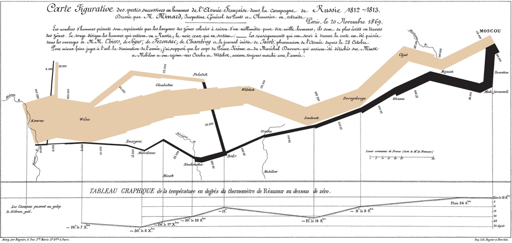
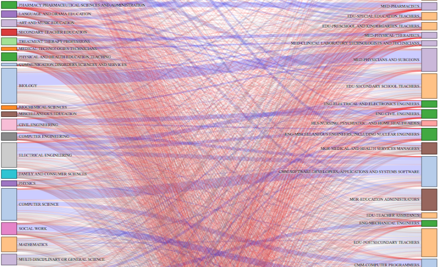
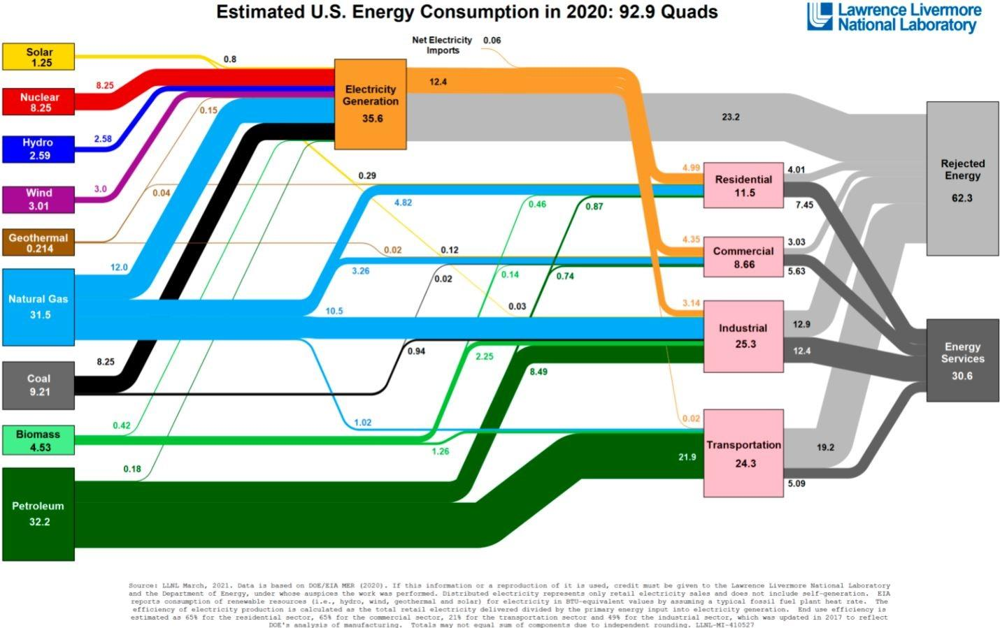
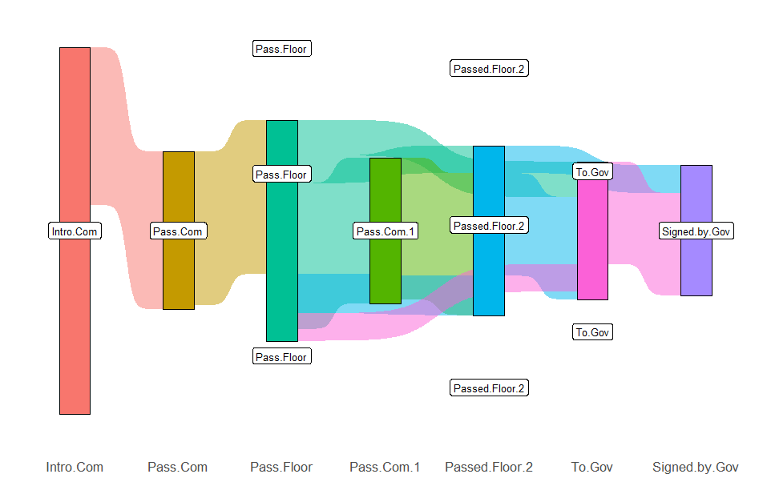
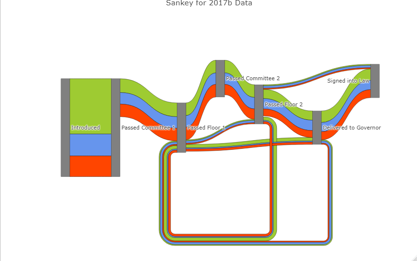
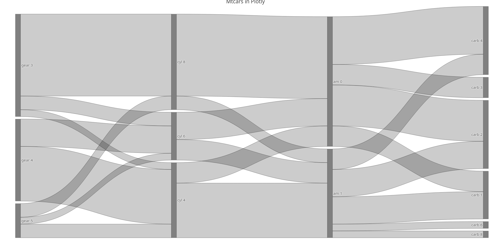
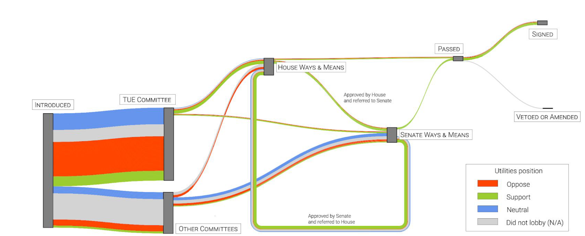
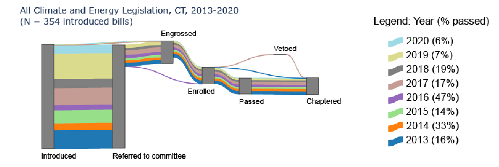

```{r, include=FALSE}
library(dplyr)
options(dplyr.summarise.inform = FALSE)
```

# Introduction

- What is a Sankey Diagram?
  - Simply put, method to visualize data that "flows" between different processes
  - Example use cases: linking majors to careers, energy consumption, life-time of bills
- Sankey diagrams are named after a man named Matthew Henry Sankey who used it to demonstrate the efficiency of energy transfer within a steam engine

# Examples

\center

# Another Example

\center
[image source: Ben Schmidt](https://flowingdata.com/2014/05/28/careers-after-the-college-degree/)

# Example I found here

\center
[image source: Life in the Built Environment](https://vtu.khpcontent.com/tewbuiltenvironment/page/ch19)

# Creating Sankeys

There are several packages that implement sankey diagrams/have sankey capabilities built on top of them.
Let us start off with ggplot's implementation: ggsankey.
```{r, warning=FALSE}
#install.packages("devtools")
#devtools::install_github("davidsjoberg/ggsankey")

library(ggsankey)
library(ggplot2)
library(dplyr)
head(mtcars[,c("gear", "cyl", "am", "carb")])
```

# Baby Example

```{r}
mt_sankey <- make_long(
    mtcars,
    gear,
    cyl,
    am,
    carb
)
head(mt_sankey)
```

# Plot

```{r, fig.height = 5}
ggplot(mt_sankey, aes(x = x,
                      node = node,
                      next_node = next_node,
                      next_x = next_x,
                      fill = factor(node))) + 
    geom_sankey()
```

# Fancier Plot

```{r, fig.height=5}
ggplot(mt_sankey, aes(x = x, node = node, next_node = next_node,
                      next_x = next_x, fill = factor(node))) +
    geom_sankey(flow.alpha = 0.6, node.color = "gray") + 
    scale_fill_viridis_d() +
    geom_sankey_label(aes(label = node), fill = "white") +
    labs(x = NULL, title = "mtcars Features") + 
    theme_minimal() + theme(legend.position = "none")
```

# Some issues...

1. ggplot creates static images
2. Some... interesting results were generated


# A New Challenger Approaches
```{r}
#install.packages("plotly")
library(plotly)
```
Plotly is a javascript based plotting software that can create several types of graphs, including Sankeys.
It solves both of the issues mentioned above, making it the ideal choice for my research project.



# Comparison in Input

```{r, output=FALSE}
mt_plotly <- mutate(mt_sankey, xnode = factor(paste(x, node))) %>%
    mutate(xnextnode = factor(paste(next_x, next_node),
                              levels = levels(xnode)))
levs <- (levels(mt_plotly$xnode))
mt_plotly <- filter(mt_plotly, !is.na(node), !is.na(next_x),
                    !is.na(next_node)) %>%
    group_by(xnode, xnextnode) %>% summarize(n = n())
plot_ly(
  type = "sankey", arrangement = "snap",
  node = list(color = "gray", label = levs, pad = 10),
  link = list(
    source = as.numeric(mt_plotly$xnode) - 1,
    target = as.numeric(mt_plotly$xnextnode) - 1,
    value = mt_plotly$n, line = list(color = "black", width = 0.5)
    )) %>%
  layout(title = "Mtcars in Plotly",
         xaxis = list(showgrid = F, zeroline = F),
         yaxis = list(showgrid = F, zeroline = F),
         font = list(size = 15),
         showlegend = T)
```

# Output



# Research

I have been working with Dr. Scerri from PSCI and the Climate Social Science Network since last semester to develop reports on the effects of lobbying on climate legislation.
My role was to develop visualizations akin to what previous studies of the sort have been using.

We invited Dr. Lucero to join in for Spring semester as a research project + credit.
With his guidance we developed a dashboard to allow people to look at the data for themselves.

# Snippets from Massachusetts Branch of Project



# Connecticut Project



# Issues with Virginia

1. Lobbyists do not have to disclose the position they are lobbying for
   - Ended up collaborating with Sierra Club to approximate climate friendliness of bills
2. There is no database to easily access climate data
   - Issue with most states 

# Final Product (on Daniel's End of Things)

<center>
    Now for a demonstration
</center>
